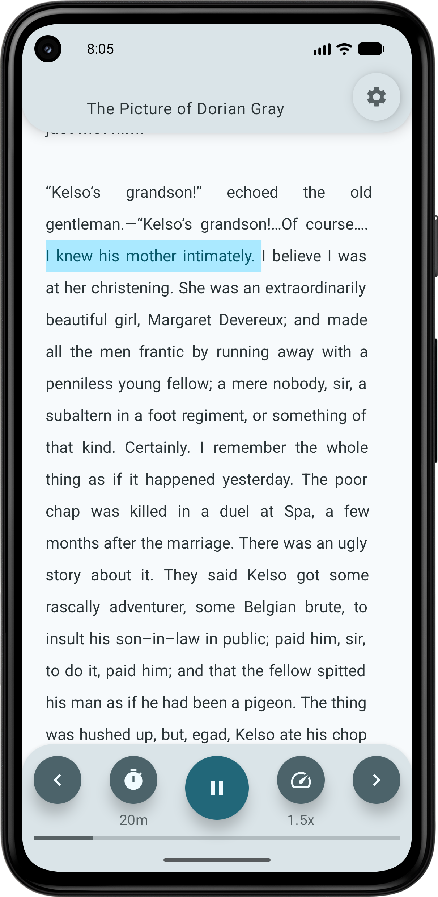
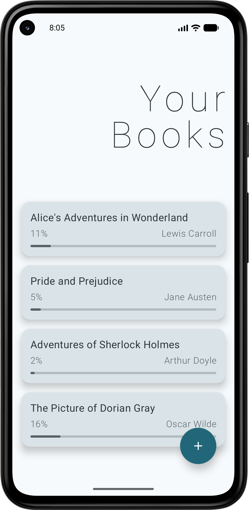
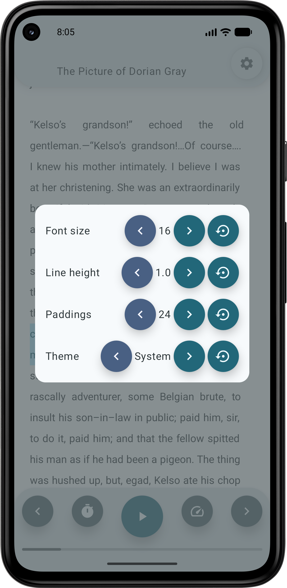
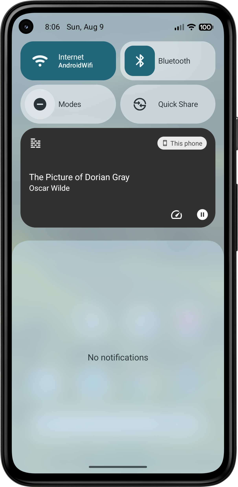

# Shelfie

### Read when you want. Listen when you can't.

**Shelfie** is an offline-first Android book reader for **FB2 and EPUB** that treats reading and listening as one continuous experience.

Read on screen, switch to Text-to-Speech when you're walking or commuting, and return to the same place when you're ready to read again.

Built with **Kotlin** and **Jetpack Compose** as an actively developed personal product.

  

## ✨ What makes Shelfie different?

Shelfie treats reading and listening as two ways of consuming the same book,
rather than two separate experiences.

Start reading on screen, switch to Text-to-Speech when you are walking,
commuting or doing something else, and return to the same place when you
want to read again.

Books and reading progress are stored locally, so the core experience works
without an account, backend or internet connection.

## 📱 Demo

  
  &nbsp;&nbsp;
  

  
  &nbsp;&nbsp;
  

## 📚 Features

* 📖 FB2 and EPUB reading
* 🔊 Built-in Text-to-Speech playback
* 🔄 Shared progress between reading and listening
* ✨ Sentence highlighting during TTS playback
* 📜 Automatic scrolling synchronized with narration
* 🎧 Background playback
* 🔔 Android media controls with play / pause
* ⏱️ Sleep timer
* ⚡ Adjustable playback speed
* 💾 Automatic reading progress persistence
* 📂 Import from device storage and Android document providers
* 📤 Open books shared from other Android applications
* 🗜️ Import from ZIP archives
* 👀 Book preview before adding it to the library
* 🌗 Light, dark, and system themes
* 🎨 Material You dynamic colors
* 🔤 Customizable typography, line height, and reader spacing

## 📱 User experience

The UI is built around keeping the reading experience uninterrupted.

Reader settings are applied immediately while the book remains visible,
loading states use skeleton animations, and importing a book includes a
preview step before it becomes part of the library.

  
  &nbsp;&nbsp;
  

## 🎧 Reading and listening are one experience

Shelfie is designed to keep configuration from interrupting reading.

When playback starts, Shelfie begins reading from the visible part of the book.
While TTS is active, the current sentence is highlighted and the reader
automatically follows the narration.

Stop listening and continue reading from the same progress.

Playback continues outside the reader through an Android foreground media
service, allowing the book to keep playing while Shelfie is in the background.

  

## 🛠 Tech stack

Shelfie is currently a single-module Android application with feature-oriented
code organization.

- **Kotlin**
- **Jetpack Compose**
- **Material 3 / Material You**
- **Coroutines & Flow**
- **MVI-style UI state management**
- **Hilt + KSP**
- **Room**
- **DataStore**
- **Navigation Compose**
- **AndroidX Media / MediaSession**
- **Android TextToSpeech**
- **Jsoup**
- **Kotlin Serialization**

The project currently targets modern Android while keeping the minimum SDK at 26.

## 🚧 Status

Shelfie is under active development.

The application is already usable for importing, reading, and listening to FB2 and EPUB books, and I use it myself while developing and validating new behavior.

Current work is focused on improving book parsing, format support, reader behavior, and the overall reading experience.

## 🔒 Source code

This repository is publicly available for portfolio and technical evaluation purposes.

**All rights reserved.** Commercial use, redistribution, or incorporation of the source code into other products requires explicit permission from the author.
